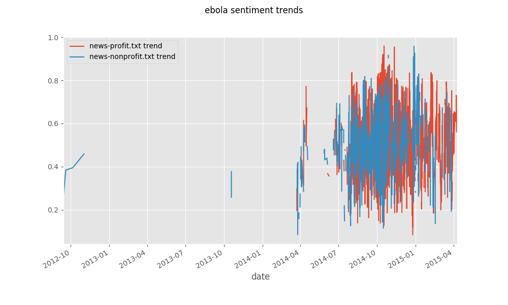
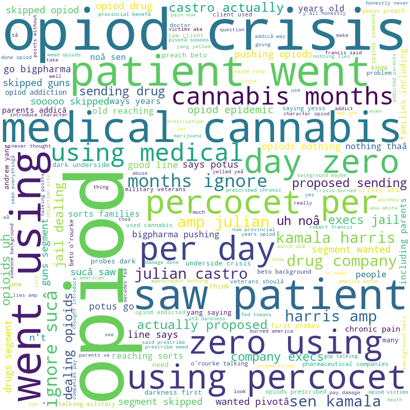

# Tell-us-how-you-really-feel-sentiment-analysis-with-Twitter 

## BUSINESS CASE
Pulling from [the NLM Jobjar project repository](https://sharepoint.nlm.nih.gov/Projects/jobjar/Lists/Associate%20Project%20Proposals/Browse%20Projects.aspx), **LO/PSD Online health information seeking: awareness and sentiment** to develop an exploratory methodology for twitter sentiment analysis and how that might inform the NLM Consumer Health Group on positive/negative tweets to contribute towards NLM interactions with consumers on various fronts such as awareness campaigns and trainings.

## MATERIALS AND METHODS
Training dataset for building the Model dataset: [Sentiment140 in Kaggle]https://www.kaggle.com/kazanova/sentiment140]
Sentiment140 dataset contains 1,600,000 tweets extracted using the Twitter API. The tweets have been annotated (0 = negative, 4 = positive) and they can be used to detect sentiment.

## Building the model
Sentiment 140 twitter 1.6 mill tweets; 

Recurrent Neural Network (RNN) model applied to data; 

State of the art RNN used to build model.  RNN performs well; takes into account words in tweets and how combined together to learn semantic meaning for each word and how when combined together model predicts sentiment.

stripped out:URLs, https, @ ; 

modified sentiment scale from 0-4 to 0/1 (binary)

80% ~ 1.2 million tweets 

Trained the model on 1.2 mill tweets

## Model
Embedding layer with 64 dimension
Bidirectional LSTM 64 dimension 
Bi LSTM layer 32
fully connected layer with 64 dimensional output
dropout .5 regularization method standard approach keep model from overfeeding
output layer single sigmoid function (generates output representing between 0-1 )

train overnight 80% accuracy ~1.0 training data 12K tweets (1K regular intervals)

20% leftover run validation 20% validation set accuracy 80%

## Model Refinement:

training increased the dimension 128; removed the drop out layer; prediction model quick check script 'i feel great' ; 'i don't feel well'--model works.

## Data on which we ran Model for Sentiment Analysis

### Health News in Twitter dataset (UCI Machine Learning Repository
( https://archive.ics.uci.edu/ml/datasets/Health+News+in+Twitter ). The data was collected in 2015 using the Twitter API. It contains health news from more than 15 major health news agencies such as BBC, CNN, and NYT - so the majority fo the tweets are direct headlines from news sories published online. 63K instances of titles have dates. Because of this, we will exaamine sentiment  and time series to see if sentiment changes. 

Ebola

Cancer

# Exploratory Datasets for Cleaning Analysis from Twitter

### Dataset 1 - Health specific tweets from TWitter API
Three subanalyses of Flu (5K), Opioid (3K) Vaping ~5K worth of tweets were accessed from the Twitter API for over the past 7 days. Flu and Opioid were downloaded into separate spreadsheets. Vaping was accessed and explored directly through the API. 

Flu and Opioid sets were examined manually to learn the nature of the tweets and to devise a cleaning strategy. The following fields from Twitter were brought into the spreadsheet: the Tweet text, polarity, subjectivity, and location. In additon, the humans labeled each tweet as: 0 negative; 1 positive; or X as neutral or out of scope.

#### Flu (5K)
We filtered through the data to see if the data is usable for determining if it would be useful for consumer health, and usable in the model. As a genarlization, most of the posts that wre not out of scope were about people discussing getting the flu shot. There was a large amount of medicine advertisment. 

#### Opioid (3K)
The opioid set contains 2,981 tweets. After filtering out duplicate tweets, the set was reduced to 1,654 = 55%. Of the remaining tweets, many were poltical:
Sen. Kamala Harris says president would hold industries accountable opiod epidemic I agree that
Bernie killing opiod question leading fossil fuels
President Trump Below Example happened Americans since CDC REDUCED Dose Pain Med
Before cleaning

After cleaning

#### Vaping (5K)
From Twitter data was pulled from Tweepy which is a package that helps use the twitter API in Python. That data was not useful - see the word cloud - the highest tweet was about a celerbity joke:
kids jon kate plus vaping yet
Pulled more granular information, by doing lots of small grabs using Python Twitter Package. Instaed of looking at 2,000 tweets at a time, we looked at 100 at a time with the hastags, and then making further small iterations. The focus turned to look into tweets to see if there was anything useful; this was a manual curation approoch. 
A few different directions were followed: people's frustration and anger:
"I vape I vote" and "Vaping saved my life"
This lead to two issues that can inform consumer health; these are issues inportant to people and worth knwiwng: 1) there are alot of people who are very loud about the use of vaping to stop smoking cigerettes and 2) the vape illness crisis has been conflated with the teen vaping crisis; they are seperate issues. Also, the vaping illness has been associated with e-cigerettes which is masking the fact that most of illness has currently been associated with THC vaping. People are angery about this for two reason: 1) it has added to the bans on nicotine vaping; and 2) it has not been effective at keeping people safe because they do not know they need to be cautious of e-THC prodcuts. Conclusion: there is a potential for useful conclusions drawn from tweets, however it took 2 days of manual curation  examination which may be too burdensome for NLM. 

#### Outcome of examining the Twitter data
It quickly became apparent that Twitter data is very dirty and noisy - dirty in that not Tweets are contain incomplete words, user generated abbreivations for common words, sentences and phrases that are not complete thoughts, contains emojicons which are not easy to interrept into sentiment; noisy as in Tweets that are wrongly associated with hashtag subject areas, advertising for products, retweets adds bulk to the data set because they are duplicate. 

Future considerations: There are many Twitter libraries that are availble to reduce unnecessary data in tweets such slang, various spellings of a word, etc. Figuring out how to best clean the data for consumer health level health terms would need to be determined for tweets to be used for sentiment anaylsis.

### Reddit Dataset
The 18,000+ Reddit Comments About Opioids set from Kaggle (https://www.kaggle.com/amalinow/18000-reddit-comments-about-opioids)was exaimined. It also presented issues with noise and dirt. The comments were very private and seemed to be off-topic. Some were about general pain.

Future considerations: Much like Twitter, a plan to best clean the Reddit data would need to be devised and tested.

### Biostars Dataset
Used the Biostars API to bring in information into Pyhton. We caputured post, title, and comment text - we used 100,000 post. We filtered with 9 key words: SPR; BLAST; GeneBank; RefSeek; PubMed; PMC; CDD; PubChem; SRAtoolkit. Output will be saved in .csv to be used in the model. Out of 5000 posts, 61 contained one of 9 key words.

## OUTCOMES
We have a good model from a deep learning algorithm that works at predicting sentiment that can be used to inform consumer health information services. We also have a greater understanding of social media data and the effort needed to produce a clean data set. 

## FUTURE CONSIDERSATIONS:

Ryan Connor suggested blogs to try:

random assortment of science blog things that may or may not be useful:
https://python.gotrained.com/tf-idf-twitter-sentiment-analysis/
http://www.rna-seqblog.com/
https://mirnablog.com/
http://www.lncrnablog.com/
https://www.bioinformatics.org/news/?group_id=10&summaries=1
https://www.reddit.com/r/flu/
https://www.reddit.com/r/bioinformatics/
https://www.reddit.com/r/librarians/

## Acknowledgments: Thanks to Victor CID for sharing his personal Twitter account information for our use.

### Team
Laura Bartlett - LO/OET

Frances Devanbu - NCBI/CSD

Igor Filippov - NCBI/IEB

Anna Ripple - LHC/CgSB

Toshu Takamaru- LO/TSD/CaMMS
